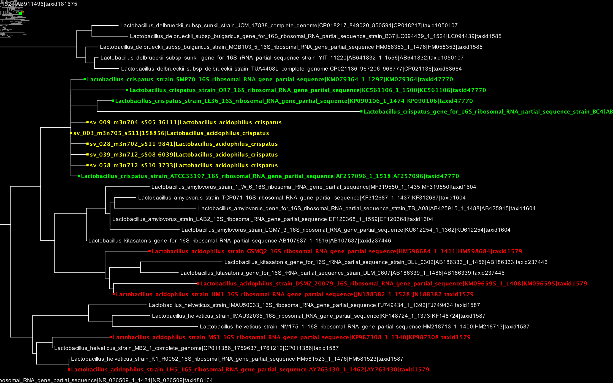
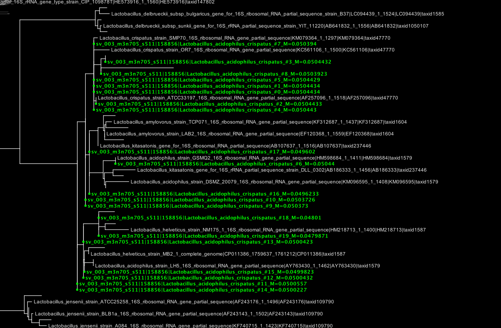
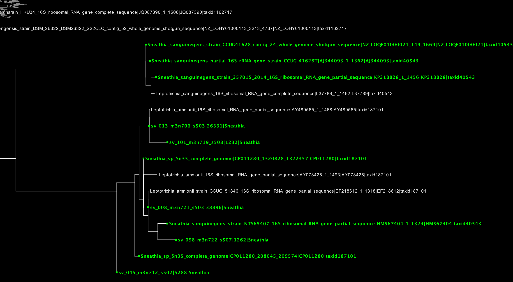
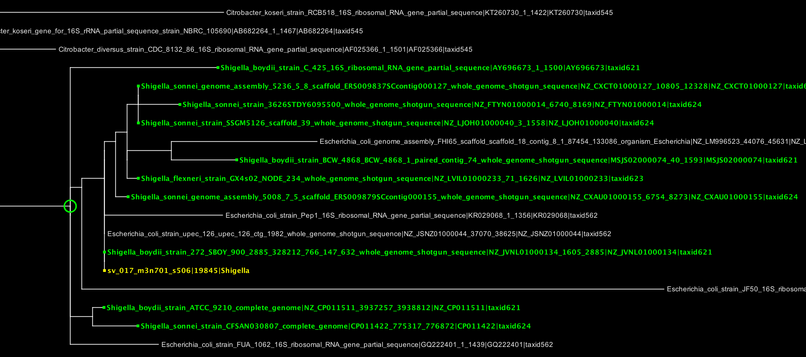
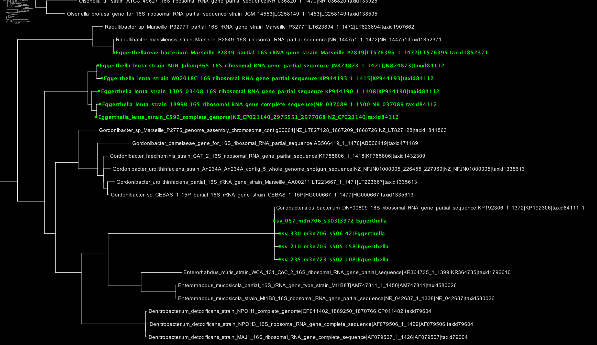
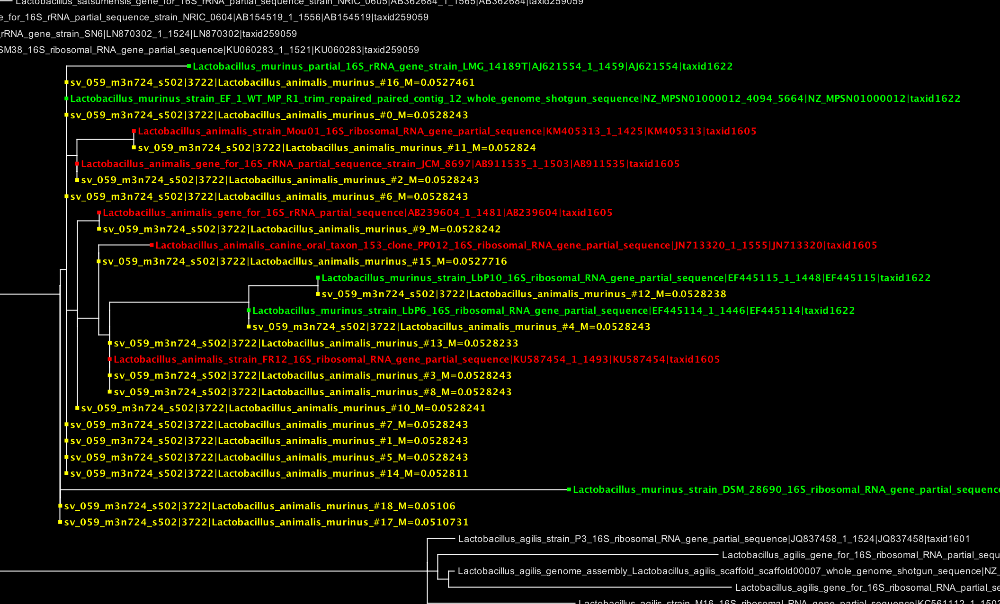

# changes

- **2017-07-05**: initial comparison with urogenital-2017-07-03_named-1.0.refpkg

# setup

Set up environment

```{r}
# venv <- list.files(pattern='*-env')
# stopifnot(length(venv) == 1)
venv <- '2017-04-03-project-trichomonas-refset-comparison-env'
Sys.setenv(VIRTUAL_ENV=normalizePath(venv))
source(file.path(Sys.getenv('VIRTUAL_ENV'), 'bin', 'rvenv'))
library(knitr)
library(tidyr)
```

# compare output

Three-way comparison

```{r}
old <- read.csv('output-urogenital_named-2015-10-29/multiclass_concat.csv', as.is=TRUE)
first <- read.csv('output-urogenital-2017-03-30_named-1.0/multiclass_concat.csv', as.is=TRUE)
second <- read.csv('output-urogenital-2017-07-03_named-1.0/multiclass_concat.csv', as.is=TRUE)
```

```{r results='asis'}
cols <- c('name', 'tax_name', 'abundance', 'rank')
versions <- c('2015-10-29', '2017-03-30', '2017-07-03')
data <- list(old, first, second)
stacked <- do.call(rbind, lapply(seq_along(data), function(i){
  x <- data[[i]][,cols]
  x$version <- versions[i]
  x
}))
stacked$name <- sapply(strsplit(stacked$name, split=':'), '[', 1)
```

Compare ranks

```{r}
levels <- c('below_superkingdom',
'below_below_superkingdom',
'phylum',
'class',
'below_class',
'order',
'below_order',
'below_below_order',
'family',
'below_family',
'genus',
'species',
'species_group')
stacked$rank <- factor(stacked$rank, levels=levels)

lapply(split(stacked, stacked$version), function(x) table(x$rank))
```

```{r}
## ranks <- tidyr::spread(stacked[, c('name', 'version', 'rank')], version, rank)
## knitr::kable(table(ranks$`2015-10-29`, ranks$`2017-03-30`))
## knitr::kable(table(ranks$`2015-10-29`, ranks$`2017-07-03`))
## knitr::kable(table(ranks$`2017-03-30`, ranks$`2017-07-03`))
```

Compare classifications

```{r}
classifications <- tidyr::spread(stacked[, c('name', 'version', 'tax_name')], version, tax_name)
abundance <- with(old, setNames(abundance, sapply(strsplit(name, split=':'), '[', 1)))
classifications$abundance <- abundance[classifications$name]
```

Differing classifications with abundance > 1000

```{r}
differing <- sapply(apply(classifications[,-c(1,5)], 1, unique), length) > 1
knitr::kable(classifications[differing & (classifications$abundance > 500),])
```

Write the full comparison to a file

```{r}
write.csv(classifications, file='comparison-2017-07-05.csv', row.names=FALSE)
```

# notes on individual organisms

## Lactobacillus acidophilus/crispatus

```{r results='asis'}
show <- grepl('acidophilus/crispatus', as.character(classifications[["2017-07-03"]]))
knitr::kable(classifications[show,])
```



A closer look at a single placement (``sv-003``) using the "sing" tree
showing the distribution of likelihoods explains the ambiguity between
crispatus and acidophilus.



Multiple alignments of these reads along with both L acidophilus and L crispatus reference sequences (note the output can scroll horizontally).

```{sh results='asis'}
echo '<pre>'
av-env/bin/av output-gethits-urogenital-2017-07-03_named-1.0/species/Lactobacillus_acidophilus_crispatus/combined.aln.fasta -n50 -r 400,850
echo '</pre>'
```

Looks like there are no distinguishing features between L acidophils and L crispatus among these reads.

## Sneathia (maybe amnii)

```{r results='asis'}
show <- grepl('Sneathia$', as.character(classifications[["2017-07-03"]]))
knitr::kable(classifications[show,])
```



## Shigella

```{r results='asis'}
show <- grepl('Shigella$', as.character(classifications[["2017-07-03"]]))
knitr::kable(classifications[show,])
```



We will remove Shigella spp. from the next refset.

## Eggerthella

```{r results='asis'}
show <- grepl('Eggerthella$', as.character(classifications[["2017-07-03"]]))
knitr::kable(classifications[show,])
```



A few observations here:

"Eggerthella sp. type 1" appears to be more closely related to a
number of species in family Eggerthellaceae than it is to Eggerthella
lenta, the only representative of genus Eggerthella in the tree. It
may be more appropriate to call it "Eggerthellaceae sp. type 1".

There are clearly representatives of this organism in NCBI among
unclassified records, and the top hits are from vaginal samples. For
example:

  - https://www.ncbi.nlm.nih.gov/nucleotide/66878729
  - https://www.ncbi.nlm.nih.gov/nucleotide/66878619
  - https://www.ncbi.nlm.nih.gov/nucleotide/486175661

The first is 100% identical to our one "Eggerthella sp. type 1"
representative, so there's no point in adding it, but the other two
can be added to the next refpkg.

## Lactobacillus animalis/murinus

```{r results='asis'}
show <- grepl('murinus', as.character(classifications[["2017-07-03"]]))
knitr::kable(classifications[show,])
```



# project info

```{sh}
pwd
git --no-pager log -n1
git status
```
